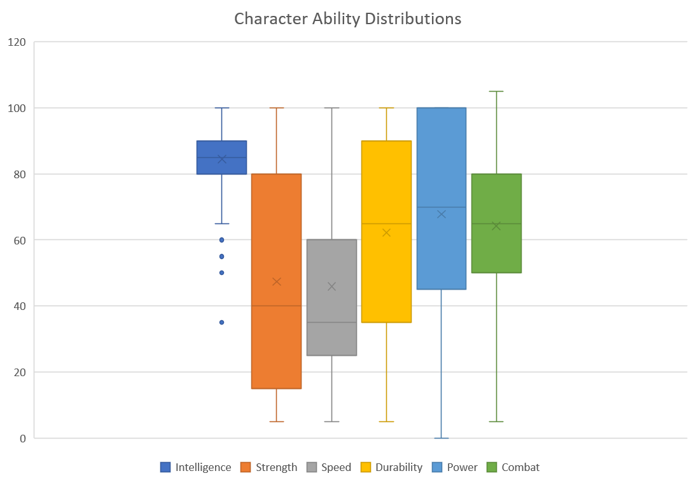

# Super-Hero-Battle
An object oriented program to test superheroes characteristics to see who wins the battle.

> Photo by <a href="https://unsplash.com/@exxteban?utm_source=unsplash&utm_medium=referral&utm_content=creditCopyText">Esteban Lopez</a> on <a href="https://unsplash.com/s/photos/hero?utm_source=unsplash&utm_medium=referral&utm_content=creditCopyText">Unsplash</a>

In this project, you will be working with a dataset of more than six hundred [differently-powered individuals](https://tvtropes.org/pmwiki/pmwiki.php/Main/DifferentlyPoweredIndividual). Some good, some bad, some neutral - each has different strengths and weaknesses, and they are being called for a showdown in the ultimate media crossover event. 

In this project, you will develop a Java program that demonstrates you can:
- Develop your own classes based on the characteristics of items in a dataset
- Develop your own child classes based on more nuanced object characteristics
- Develop your own methods that override methods in a parent class
- Use polymorphism to conduct an analysis of objects with many child classes
- Implement the Comparable interface to allow objects to be sorted in a Collection
- Output the results of your analysis to a file

## Step 1 - Inspect the Included Dataset
The included file, `SuperHeroes.csv`, contains a collection of super-powered or notable fictional individuals: heroes, villains, cosmic entities, starship captains, and many more. This is a comma-separated value (csv) file, and each line is a record. The properties of each record are separated by a comma. This is a simple text file format that is supported by many programming languages and packages. The more you work with these, the harder it will become to make a trip to a pharmacy without a verbal slip.

Each has a set of characteristics that define them:

- **Intelligence**: how smart are they? can they think their way out of a trap, or devise one for their foes?
- **Strength**: how much can the lift, push or pull, in terms of physical mass?
- **Speed**: how fast are they? how quick are their reflexes? can they get out of trouble fast, or bring trouble to the enemy?
- **Durability**: can they take a hit? can they walk away unscathed, and live to fight another day?
- **Power**: do they have an amazing superpower, such as a Jedi using the force or Godzilla blowing energy across entire cities? Or is this Paul Blart, Mall Cop (I'm not kidding...he's in here, and he's terrible).
- **Combat**: are they scrappy, and good in a fight?
- **Others**: gender, race, eye color, and other descriptive characteristics.

| Name        | Intelligence | Strength | Speed | Durability | Power | Combat | Full name              | Alignment | Gender | Race              | Height (cm) | Weight (kg) | Eye color | Hair color | Occupation                                            |
|-------------|--------------|----------|-------|------------|-------|--------|------------------------|-----------|--------|-------------------|-------------|-------------|-----------|------------|-------------------------------------------------------|
| 3-D Man     | 80           | 35       | 45    | 35         | 25    | 55     | Charles Chandler       | good      | Male   | -                 | 188         | 90          | Brown     | Grey       | Test pilot  adventurer                                |
| Abe Sapien  | 95           | 30       | 35    | 65         | 100   | 85     | Abraham Sapien         | good      | Male   | Icthyo Sapien     | 191         | 65          | Blue      | No Hair    | Paranormal Investigator                               |
| Abin Sur    | 80           | 90       | 55    | 65         | 100   | 65     | -                      | good      | Male   | Ungaran           | 185         | 90          | Blue      | No Hair    | Green Lantern  former history professor               |
| A-Bomb      | 75           | 100      | 20    | 80         | 25    | 65     | Richard Milhouse Jones | good      | Male   | Human             | 203         | 441         | Yellow    | No Hair    | Musician  adventurer  author; formerly talk show host |
| Abomination | 85           | 80       | 55    | 90         | 65    | 95     | Emil Blonsky           | bad       | Male   | Human / Radiation | 203         | 441         | Green     | No Hair    | Ex-Spy                                                |

Open up the file in the spreadsheet application of your choice (e.g., Excel, Google Sheets) and review the data to get acquainted with it. Try to get a sense for the different types of superheroes there, and look for things they have in common. As you are looking, start to think of classes for these SuperHeroes that you might want to use in the upcoming Battle Royale. If you have trouble coming up with fun and descriptive names, you can always draw upon the many examples found at [tvtropes.org](https://tvtropes.org/pmwiki/pmwiki.php/Main/SuperheroTropes), though be careful - that site is a massive time sink if you get sucked in. 

> [Box and Whisker](https://en.wikipedia.org/wiki/Box_plot) plot of the ranges and distribution for each of the six ability characteristics. Each characteristic has a different range and distribution. High intelligence is fairly common, but high speed is fairly rare. Strength varies dramatically. Where do you think your favorite hero or villain falls in this plot?

The world of SuperHeroes is much more interesting and complex than this. High-intelligence alone may not be the sole reason a Superhero is powerful (in fact, from the box plot, high intelligence is the most common characteristic). Someone who is not just intelligent, but also has high speed, can make smart decisions and act on them much faster than someone who is slow. Someone may have high power, but low durability, and be unable to deal damage to an opponent with a higher combat ability. 

**Deliverable 1:** 
- Your first deliverable is to identify four classes of heroes that are found here based on their attributes. Document in the `responses.md` your four named classes and the criteria that you would use to define them. There are really no wrong answers, as long as they are based on attributes in the dataset and fight in a slightly different way than the basic `SuperHero` class. They cannot all be ordinal attributes, at least one class must use one of the categorical String attributes (e.g., hair color, occupation).
- Second, you must identify two child classes of heroes that are found here based on a two or more ordinal attributes in a certain range or categorical attributes that match a given value. These classes should extend from the descriptions of at least one of your categories defined above (they can both be from the same super class, or from two different classes). Document in the responses file your two named child classes and the criteria that you would use to define them. There are really no wrong answers, as long as they are based on two or more of the attributes in the dataset and fight in a slightly different way than their parent class.

## Step 2 - Develop Child Classes for your Categories
In your src folder, we have provided you with a parent class called `SuperHero`. Each instance of your child classes *is-a* SuperHero. You may alter SuperHero by adding fields or adding/altering methods (except where indicated). A third class, `BattleRoyale`, contains the main method. 

The SuperHero class is used to create objects that store all the attributes of a SuperHero from the included datafile. Each of these is private, and should not be modified outside the class. You should write getter methods for any fields that you need to return, but do not provide setter methods as these fields are final. There is one constructor provided that takes each of the field values as an array of String objects and converts them to the appropriate type. This is particularly useful for reading csv files.

Included in `DataReader` is a method `readDataFileAndClassify` that takes a file name and reads each line of the file as a String. For each String, it uses the `parseRow` method to split the String into an array of String objects. The array is equal in length to the number of values that were separated by commas in the original line, and the `parseRow` method checks each line to make sure enough data was present. 

The String array represents the attributes of that superhero. The `readDataFileAndClassify` method must then decide what type of superhero will be created. So far, it only knows about `SuperHero` superhero types. To determine if a superhero record meets the criteria of being a SuperHero, it calls a static method `meetsConditions`. If true, then the superhero meets the conditions of being an object of that class and a new `SuperHero` is created and added to the growing arrayList of SuperHero objects. Keep this section in mind, because you will come back and modify this part of the code for each child class you create. 

> A powerful hint - a superhero may meet the conditions of more than one of your classes - the order in which you check will likely affect how many of each type are created. You may want to check the more specific child classes BEFORE you check the conditions of a parent class. 

The `SuperHero` class has a static implementation of the `meetsConditions` method that always returns true, because all records meet the conditions for being a basic superhero. All child classes should override this method with their own specific criteria.

The `SuperHero` class has a method called `attack` that takes another SuperHero as a parameter. It returns the difference between the combat attribute of the current SuperHero object and the other SuperHero object. Regardless of all their other powers and abilities, this is the basic method for determining how much damage one superhero would deal to another. If positive, it means that this superhero would deal that much damage to the other superhero. If zero, it means that no damage is dealt on this attack. A hero cannot deal negative damage.

The `SuperHero` class has a method called `defend` that takes an amount of damage as a parameter. It returns the difference between the durability attribute of the current SuperHero object and the damage to determine how much damage the hero can defend. Whatever is left over is returned as an int. 

Both the `attack` and `defend` methods are used by the `combat` method, which demonstrates what it means for one hero to fight another. Each hero attacks the other, and they both defend as much damage as they can. Whichever deals the most damage is the winner, as indicated by the returned integer.

Your child classes will override the `attack` and `defend` methods, but not the `combat` method. It is `final`. The changes that you make to your child class attack/defend methods will influence how successful they are in the overall Battle Royale, but this will only affect the amount of damage they take or defend against. 

> Lost in the multiverse? Some students are not quite sure what to do here, and what you are limited to. This part is fairly open-ended, but you must do something. If a hero is smart, maybe they deal extra damage on top of combat based on HOW smart they are? If they have red hair, maybe they deal extra damage to all other heroes that don't have red hair? Your classes may deal extra (or less) damage to specific other classes that you have created, creating a rock-paper-scissors scenario. The class of an object can always be determined through by getting the name of the class of an object as a String. See the `toString` of `SuperHero` for an example. 

To complete this step, you must design four child classes that extend `SuperHero` and overrides the `attack`, `defend`, and `meetsConditions` methods. They should use the methods of the parent classes through `super()`. These classes should match the names and fulfill the requirements of your categories above.

**Deliverable 2:** Four child classes matching your category descriptions.

## Step 3 - Develop child classes for your SubCategories

To complete this step, you must design two more classes that extend one or more of your child classes defined in Step 2. These should also override the `attack`, `defend`, and `meetsConditions` methods and should use the methods of the parent classes through `super()`. These classes should match the names and fulfill the requirements of your subcategories above.

**Deliverable 3:** Two child classes matching your subcategory descriptions.

## Step 4  - Ready to Rumble 

In the `BattleRoyale` method, you should call the static `readDataFileAndClassify` method in `DataReader` to create an arraylist of SuperHero objects with all the appropriate classes that you have defined above. That means that, as promised, you will need to modify the `classifyHero` method to create each object depending on which criteria it meets for the child classes. 

Once you have your arraylist, it's time to Battle! Each superhero should fight each other superhero in the dataset. For each fight, use the `combat` method to determine a victor. Once you have a winner, track who won, lost, or if it is a tie. You may find it handy to add a method to one or more of your classes to update this data for that object or class.

Some conditions:
- A superhero does not fight itself (two superheros with the same name can still fight each other). 
- Each pairing should occur only once. This should not be an n2 battle, but an n(n-1)/2 battle.
- Everyone fights everyone, regardless of good/bad/neutral status. The stakes are high!

> Hint: you may think that you need to create arrays or many other variables to track all of this information. That's way too much work. Instead, think about static and non-static fields. Non-static fields can be used to track data for an individual object of the class (e.g., the number of `Thor` victories). Static fields can be used to track data for an entire class.

**Deliverable 4 :** The`main` that loads the file and matches each superhero against all the others according to the rules above.

## Step 5  - Compare One to Another

In the `SuperHero` class, you should implement the `compareTo()` method that allows one hero to be compared to another. You will also need to implement the appropriate interface. Once you are done, you will be able to sort a Collection of SuperHero objects using one of the built-in JDK implementations of sort.

SuperHero objects should be compared by the ratio of wins to losses for that object. If the current object has a higher ratio, then the method should return positive. If the other object has a higher ratio, then the method should return negative. If they are equal to within one one-hundredth of a percent, then the method should return zero.

**Deliverable 5 :** The updated `SuperHero` class that allows objects to be compared to each other and sorted.

## Step 6 - Report your Results

Once the battle has concluded, output your results to a file `results.txt` for subsequent review. 

The report should consist of two formatted sections: 

1. For each of your created child classes and `SuperHero` report the number of times they win, lose, and tie. Each class should get its own line. Underneath, report which child class won the most.
2. For each individual superhero, report how many times they win, lose, or tie. Each superhero should get its own line. This section should be sorted by the win/loss ratio of each hero (ascending). 

**Deliverable 6 :** Your code generates a report with the required sections.

# Getting Stuck
There are times when you might get stuck on some part of an assignment. It happens to the best of us. If you need assistance on a specific part of your code, then be sure to try to `push` the most recent version of your files to GitHub. It makes it much easier for your instructor and TA to provide specific feedback on individual lines of code in the files that you submit. 

## Acknowledgements
The data set used in this project is modified from a public set hosted by Aman Shrivastava on Kaggle at [https://www.kaggle.com/thec03u5/complete-superhero-dataset](https://www.kaggle.com/thec03u5/complete-superhero-dataset). 
